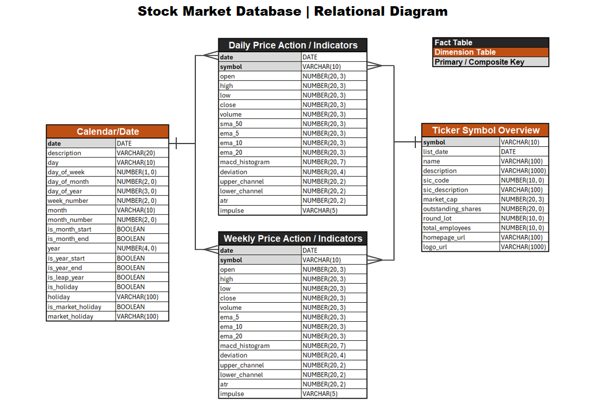
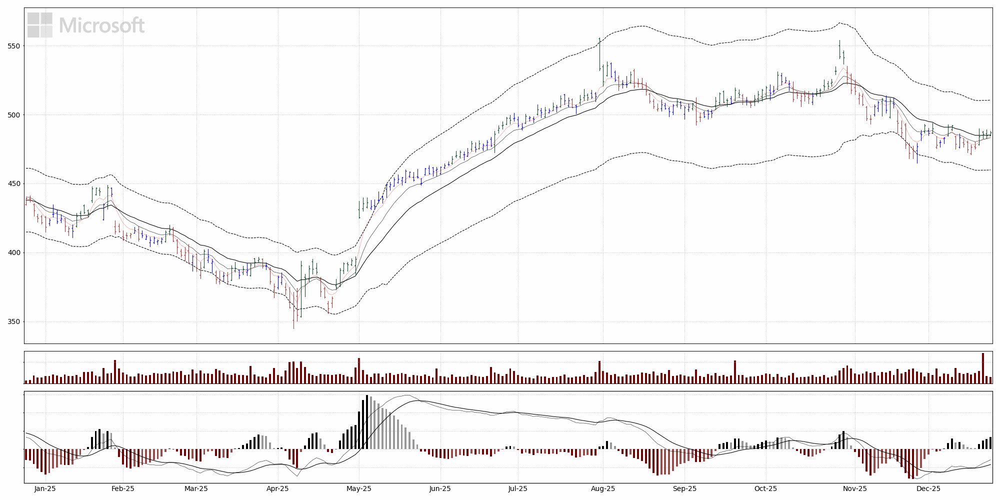

# Stock Market Database and Visualization Utilities
___
## Overview
Leveraging **Python** and **[Massive's RESTful API](https://massive.com/)** service (formerly Polygon.io), I've created the following:
1. **SQLite** Database Creation Pipeline
2. Stored Procedures to perform DB updates/maintence 
3. Charting utilities to visualize data from our newfound DB with **matplotlib**

These modules are fully operational as I depend on them for my day-to-day market analysis/backtesting. Let's unpack each of these in a little more detail.

## [SQLite Database Creation Pipeline](Database)
___
Using a 3P API/Data Service is an inherently IO-bound task, which is why [polygon_api.py](Database/polygon_api.py) makes use of the **AIOHTTP** library. This provides an HTTP client that support asynchronous requests to Massive, significantly improving DB build times. Asynchronous calls are made in strategically sized batches to respect Massive's 100 request per second [rate limit](https://massive.com/knowledge-base/article/what-is-the-request-limit-for-massives-restful-apis).

The DB table structures are stored in [table_maps.py](Database/table_maps.py). They are expressed in  a JSON style to make configuration updates (column renames, change in data types) simple. The database structure is outlined in the diagram below:

### Table Summary
___
**Daily** - The daily price action of over 5,000 stock market symbols, enriched with popularly used indicators (MACD, EMA's).

**Weekly** - The weekly price action of those same symbols, enriched with the same indicators (minus SMA_50).

**Symbol** - Metadata about the underlying companies (website, logo url, list date)

**Calendar** - A standard DB date table to facilitate time intelligence queries (built using the **Pandas** and **Holidays** libraries).

## Database Stored Procedures
___
What good is a database if it doesn't update and stay relevant? These [**stored procedures**](Database/procedures.py) are scheduled to run after each market day with the intended goals in mind:
1. Retrieve the latest price action from **[Massive's RESTful API](https://massive.com/)**
2. Calculate the latest indicator derivatives
3. Boot inactive stocks from the database
4. Recruit symbols recently listed on the market

The database creation script and update procedures are kept in the same module, as a lot of the same code can be reused.

## [Data Visualizations](Charts)
___
To continue the trend, what good is a relevant database without rich visualizations bringing it to life? Using the **matplotlib** library, I was able to accommodate my specific requirements for visualizing stock data and do it at scale with my [**chart utilities**](Charts/chart_utils.py).

### Daily timeframe visualizing price action, volume totals and MACD data with the company logo.

**matplotlib** is essential when creating charts that require a high level of customization. These were my absolute must-haves while creating these:
1. Superimposing the company logo in the upper left section of the chart.
2. Plotting price action data in an OHLC style, no candles and no lines.
3. Coloring the OHLC bars in accordance with impulse indicator data.
4. Plotting MACD histogram and MACD lines in the same axes, but with separate y-axes.

### Logo transformation and image placement
Logos were the first challenge, but the Python image processing library, [**pillow**](https://pillow.readthedocs.io/en/stable/index.html), allowed me to scale all logos to a fixed height of 50 px and pass them through a grayscale transformation for thematic consistency. To see the full extent of the dynamic image placement as well as the image format conversion, view the source in the [**overlay_image( )**](Charts/chart_utils.py) function.

### OHLC bar construction
Getting the OHLC bar shape I wanted was tricky, too. Not offered out of the box, I was able to get what I wanted by plotting high and low prices individually with a solid line style, then plotting the open and close prices separate, but as left and right tick-markers, respectively. You can view the source in the [**plot_ohlc( )**](Charts/chart_utils.py) function.

### Painting OHLC bars with impulse data
As an extension of the original OHLC problem, I also wanted to apply coloring consistent with the [impulse stock indicator](https://toslc.thinkorswim.com/center/reference/Tech-Indicators/studies-library/G-L/Impulse). The impulse data is available and stored in my database, but to paint the OHLC bars, I would have to convert the DB values of "Red", "Green" and "Blue" to an actual hex color code. Python's **pandas** library came through for me here, and allowed me to apply a map function to the original DB values, swapping the color placeholders with hex code colors of my choosing. The source is also in the [**plot_ohlc( )**](Charts/chart_utils.py) function.

### Duplicating underlying axes to allow independent y-bounds scale
A MACD histogram is a popular indicator choice, but whether it's accompanied by the underlying lines is a personal preference. My challenge was plotting both on the same child axes. Normally this isn't a problem, but the underlying MACD lines are usually more volatile in their values, usually pushing the y-bounds beyond where they would normally set if it was just the histogram. To fix this, I superimposed another child axes onto the original using the [matplotlib.axes.twinx( )](https://matplotlib.org/stable/api/_as_gen/matplotlib.axes.Axes.twinx.html) method, allowing the MACD lines to be plotted with an independent y-axis, keeping the visualization scaled properly for both data sets. The source code for this, as well as other features like MACD bar color are found in the [**plot_macd( )**](Charts/chart_utils.py) function.

My [chart creation pipeline](Charts/build_daily_charts.py) is scheduled to run after my stored procedures finish updating my database. Keeping my charts fresh makes it easy for me to review them day to day, and inspire new ideas for trading strategies.

## What's Next?
___
I hope to keep building onto this, as I want to create utilities that will backtest and visualize algorithmic trading strategies. With five years of data in my DB, I have a solid foundation to gather statistical insight into what works, and what doesn't. In terms of different visualizations, I also wish to create some geared towards market breadth analysis, or showing how the market is doing as a whole.

